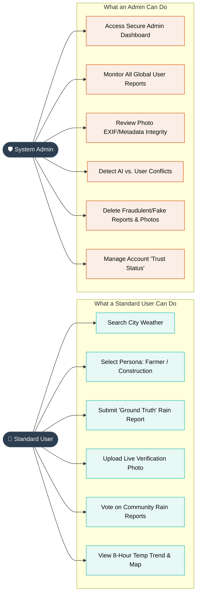

# RainCast Professional Diagrams

Here are the professional, fully updated Mermaid diagrams for your presentation. You can copy this code and paste it directly into any Mermaid viewer (like [mermaid.live](https://mermaid.live)) or markdown editor that supports it to generate the images.

---

### 1. Updated Overall System Architecture (Fixed Overflow)
This diagram is structured cleanly top-to-bottom so it won't overflow, and it looks highly professional with custom colors.

```mermaid
graph TD
    %% Professional Color Styles
    classDef user fill:#3498db,stroke:#2980b9,stroke-width:2px,color:white,border-radius:5px
    classDef frontend fill:#9b59b6,stroke:#8e44ad,stroke-width:2px,color:white
    classDef backend fill:#e67e22,stroke:#d35400,stroke-width:2px,color:white
    classDef storage fill:#2ecc71,stroke:#27ae60,stroke-width:2px,color:white
    classDef external fill:#f1c40f,stroke:#f39c12,stroke-width:2px,color:black

    %% External APIs
    OpenWeather[OpenWeather API]:::external

    %% User Interaction
    UI[RainCast Dashboard (Glassmorphism)]:::frontend
    User([End User / Admin]):::user
    User -->|Interacts with| UI

    %% Application Logic
    subgraph Application_Core [RainCast Backend Processing]
        direction LR
        WeatherFetcher[Weather Retrieval Module]:::backend
        AIEngine[AI Prediction Engine]:::backend
        PhotoVerifier[Ground Truth / EXIF Verifier]:::backend
        SupportModule[Decision Support Module]:::backend
    end

    %% Storage
    DB[(Database / JSON Data Storage)]:::storage

    %% Core System Workflows
    UI -->|1. Searches Location| WeatherFetcher
    WeatherFetcher -->|2. Fetches Data| OpenWeather
    OpenWeather -->|3. Retrieves Live Data| AIEngine
    
    UI -->|4. Uploads Report + Photo| PhotoVerifier
    UI -->|5. Selects Farmer/Builder| SupportModule
    
    AIEngine -->|Predicts Rain Probability| DB
    PhotoVerifier -->|Validates Photo Metadata| DB
    
    DB -->|Updates Map & Trend Charts| UI
```

---

### 2. User vs Admin Capabilities Diagram
This clearly separates everything a standard user is allowed to do versus everything an admin is allowed to do, as requested.


